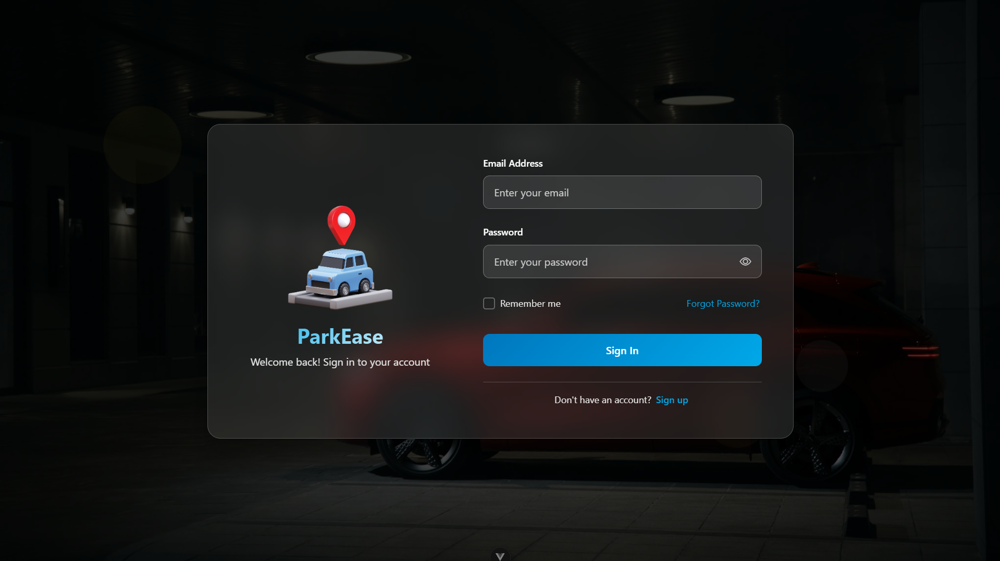
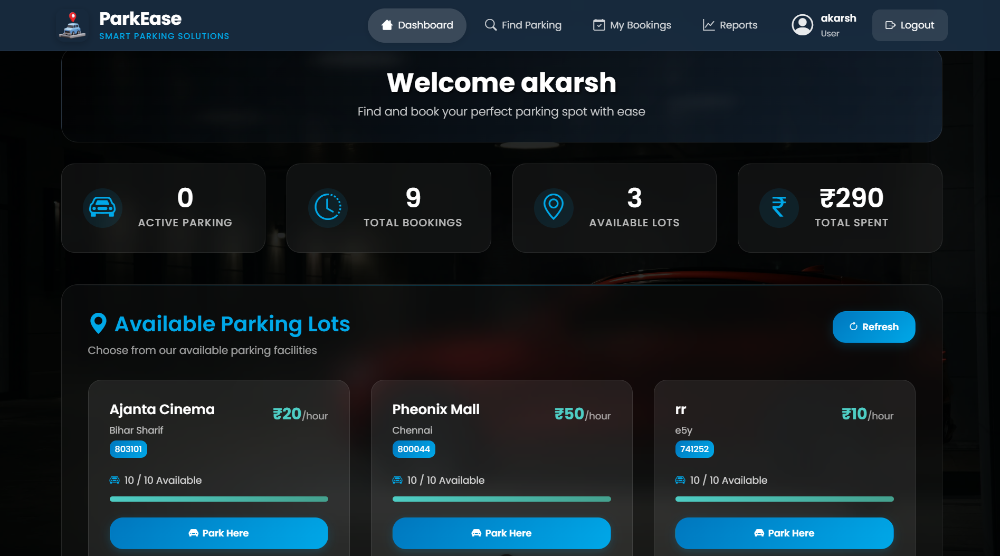
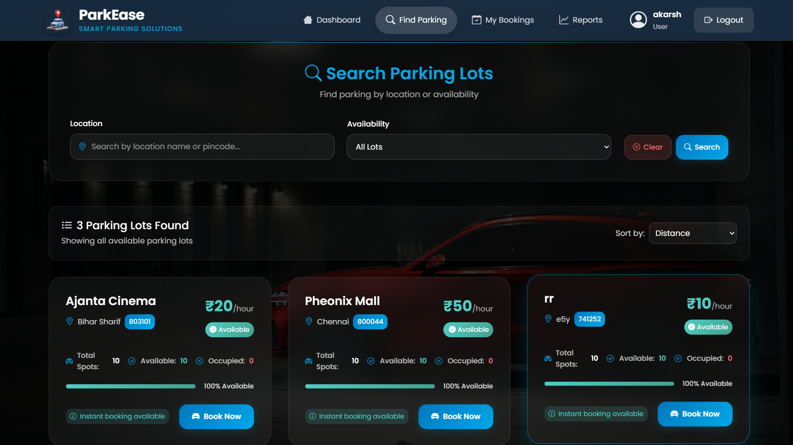
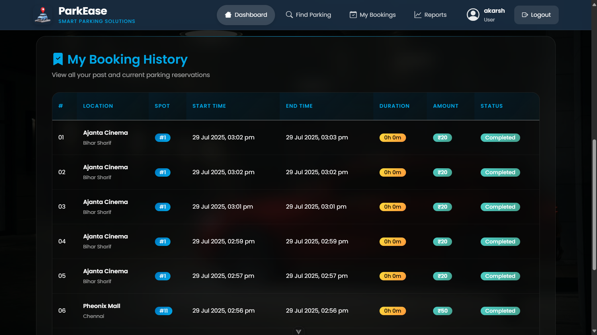
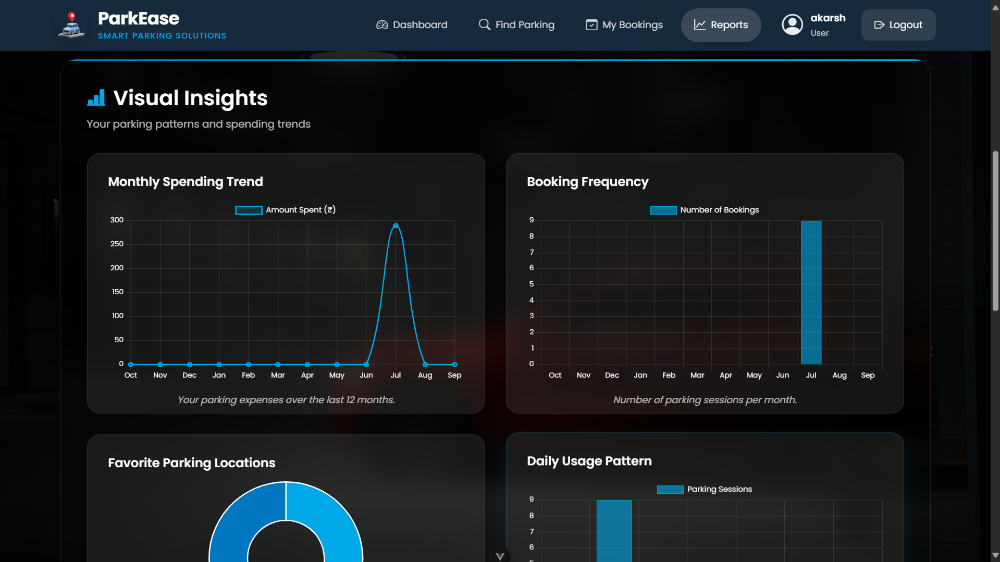
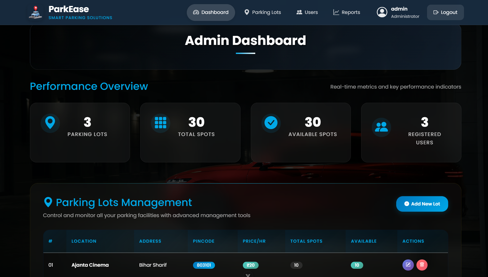
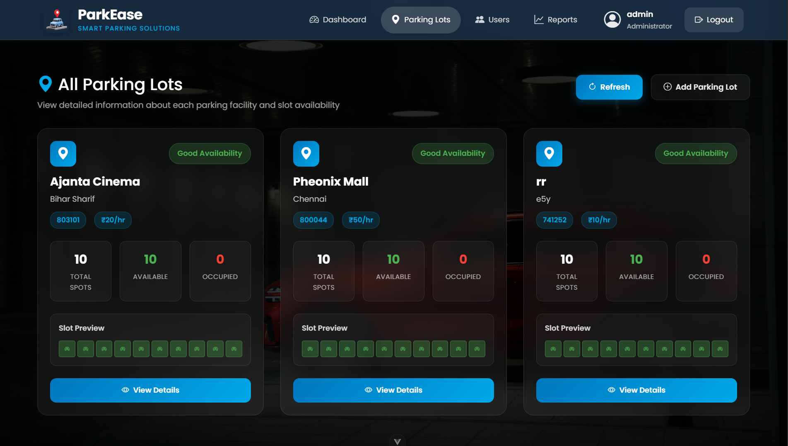
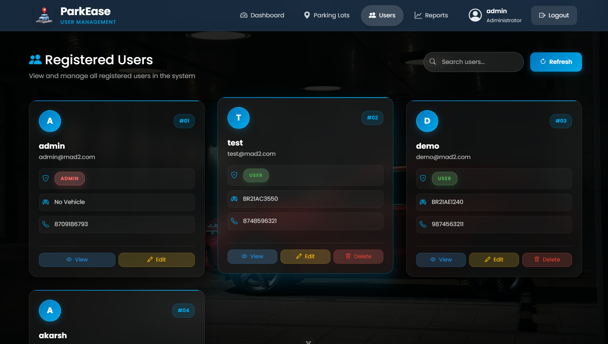

# ParkEase - Smart Parking Management System

[](https://python.org)
[](https://vuejs.org/)
[](https://flask.palletsprojects.com/)
[](https://redis.io/)
[](https://celeryproject.org/)

**ParkEase** is a comprehensive smart parking management system built as part of the MAD 2 (Modern Application Development 2) project. It provides a complete solution for urban parking with real-time availability tracking, automated booking system, payment integration, and advanced analytics.

## 🚀 **Project Overview**

ParkEase revolutionizes urban parking by providing:

- **Real-time parking spot availability**
- **Automated booking and payment system**
- **Admin dashboard for parking lot management**
- **User-friendly mobile-responsive interface**
- **Advanced analytics and reporting**
- **Email notifications and background task processing**

---

## **Architecture**

### **Frontend (Vue.js 3)**

- **Framework**: Vue.js 3 with Composition API
- **Build Tool**: Vite
- **Routing**: Vue Router 4
- **Styling**: Custom CSS with responsive design
- **Charts**: Chart.js integration for analytics

### **Backend (Flask)**

- **Framework**: Flask with Flask-RESTful
- **Database**: SQLAlchemy
- **Authentication**: JWT-based authentication
- **Task Queue**: Celery with Redis broker
- **Email**: MailHog integration for development
- **Caching**: Redis for performance optimization

---

## 📁 **Project Structure**

```
parking_app_22f3002362/
├── 📁 backend/
│   ├── app.py                 # Flask application entry point
│   ├── models.py              # Database models (User, ParkingLot, etc.)
│   ├── controllers.py         # API endpoints and business logic
│   ├── tasks.py               # Celery background tasks
│   ├── celery_app.py          # Celery configuration
│   ├── requirements.txt       # Python dependencies
│   ├── start_services.bat     # Server startup script
│   └── instance/
│       └── parking_app.db     # SQLite database
├── 📁 frontend/
│   ├── src/
│   │   ├── components/        # Vue components
│   │   │   ├── Landing.vue    # Landing page
│   │   │   ├── Login.vue      # User authentication
│   │   │   ├── Register.vue   # User registration
│   │   │   ├── FindParking.vue # Parking search
│   │   │   ├── UserDashboard.vue # User dashboard
│   │   │   ├── AdminDashboard.vue # Admin panel
│   │   │   ├── MyBookings.vue # Booking management
│   │   │   └── ParkingLots.vue # Lot management
│   │   ├── services/
│   │   │   └── api.js         # API service layer
│   │   ├── router/
│   │   │   └── index.js       # Route definitions
│   │   └── App.vue            # Main application component
│   ├── package.json           # Node.js dependencies
│   └── vite.config.js         # Vite configuration
├── README.md                  # Project documentation
└── REDIS_GUIDE.md            # Redis implementation guide
```

---

## ⚡ **Key Features**

### **For Users (Drivers)**

- 🔍 **Smart Parking Search**: Find available parking spots by location
- 📱 **Real-time Booking**: Instant reservation with spot assignment
- 💳 **Integrated Payments**: Multiple payment options (UPI or Card)
- 📊 **Booking History**: Track all parking sessions and expenses
- 📧 **Email Notifications**: Booking confirmations and receipts
- 🚗 **Vehicle Management**: Register and manage multiple vehicles

### **For Admins (Parking Owners)**

- 🏢 **Lot Management**: Create, update, and delete parking lots
- 📈 **Analytics Dashboard**: Revenue, occupancy, and usage statistics
- 👥 **User Management**: View and manage registered users
- 📊 **Reporting System**: Generate detailed reports and exports
- 🎯 **Real-time Monitoring**: Live parking spot status updates
- 💰 **Revenue Tracking**: Daily, weekly, and monthly earnings

### **System Features**

- 🔄 **Real-time Updates**: Live availability tracking with Redis caching
- ⚡ **Background Processing**: Celery for email notifications and tasks
- 🛡️ **Secure Authentication**: JWT-based auth with role-based access
- 📱 **Responsive Design**: Mobile-first responsive interface
- 🚀 **Performance Optimized**: Redis caching for fast responses
- 📧 **Email Integration**: Automated notifications for all actions

---

## � **Screenshots**

### **User Interface**

#### **Landing Page**


_Clean and modern landing page with intuitive navigation_

#### **Login Page**


_Clean and modern login page with glass morphism effect_

#### **User Dashboard**


_Comprehensive user dashboard showing booking history and quick actions_

#### **Find Parking**


_Smart parking search with real-time availability_

#### **Booking History of Users**


_Full Booking History for users to manage and track their daily bookings and spendings_

#### **User Reports & Analytics**


_Detailed reports and analytics for users_

### **Admin Interface**

#### **Admin Dashboard**


_Powerful admin dashboard with analytics and metrics_

#### **Parking Lot Management**


_Easy-to-use parking lot management interface_

#### **User Management**


_Comprehensive user management system_

#### **Reports & Analytics**


_Detailed reports and analytics for business insights_

---

## �🛠️ **Technology Stack**

### **Frontend Technologies**

| Technology  | Version | Purpose                          |
| ----------- | ------- | -------------------------------- |
| Vue.js      | 3.5.17  | Progressive JavaScript framework |
| Vite        | 7.0.0   | Fast build tool and dev server   |
| Vue Router  | 4.5.1   | Client-side routing              |
| Pinia       | 3.0.3   | State management                 |
| Axios       | 1.10.0  | HTTP client for API calls        |
| Chart.js    | 4.5.0   | Data visualization               |
| Vue-ChartJS | 5.3.2   | Vue wrapper for Chart.js         |

### **Backend Technologies**

| Technology         | Version | Purpose                       |
| ------------------ | ------- | ----------------------------- |
| Flask              | Latest  | Web framework                 |
| Flask-SQLAlchemy   | Latest  | ORM for database operations   |
| Flask-RESTful      | Latest  | RESTful API development       |
| Flask-JWT-Extended | Latest  | JWT authentication            |
| Flask-CORS         | Latest  | Cross-origin resource sharing |
| Celery             | 5.3.1   | Distributed task queue        |
| Redis              | Latest  | Caching and message broker    |

### **Development Tools**

- **ESLint**: Code linting for JavaScript
- **Prettier**: Code formatting
- **MailHog**: Email testing in development
- **Redis**: In-memory data structure store

---

## 🚀 **Quick Start Guide**

### **Prerequisites**

- Python 3.13+
- Node.js 18+
- Redis Server
- Git

### **1. Clone the Repository**

```bash
git clone https://github.com/22f3002362/parking_app_22f3002362.git
cd parking_app_22f3002362
```

### **2. Backend Setup**

```bash
cd backend

# Install Python dependencies
pip install -r requirements.txt

# Start Redis server (in separate terminal)
redis-server

# Start Celery worker (in separate terminal)
python -m celery -A celery_app.celery worker --loglevel=info

# Start Celery beat scheduler (in separate terminal)
python -m celery -A celery_app.celery beat --loglevel=info

# Start Flask application which will create database too
python app.py
```

### **3. Frontend Setup**

```bash
cd frontend

# Install Node.js dependencies
npm install

# Start development server
npm run dev
```

### **4. Access the Application**

- **Frontend**: http://localhost:5174
- **Backend API**: http://localhost:5000
- **MailHog Web UI**: http://localhost:8025

---

## 🔧 **Configuration**

### **Environment Variables**

Create a `.env` file in the backend directory:

```env
# Celery Configuration
CELERY_BROKER_URL=redis://localhost:6379/0
CELERY_RESULT_BACKEND=redis://localhost:6379/0

# Redis Configuration
REDIS_HOST=localhost
REDIS_PORT=6379
REDIS_DB=0

# MailHog Configuration
MAILHOG_SERVER=localhost
MAILHOG_PORT=1025
MAILHOG_WEB_PORT=8025

# JWT Configuration
JWT_SECRET_KEY=your-secret-key-change-in-production

# Database Configuration
SQLALCHEMY_DATABASE_URI=sqlite:///parking_app.db
```

## 📡 **API Documentation**

### **Authentication Endpoints**

```http
POST /login              # User login
POST /logout             # User logout
POST /users              # User registration
```

### **Parking Management**

```http
GET    /parking-lots     # Get all parking lots
POST   /parking-lots     # Create parking lot (admin)
PUT    /parking-lots/:id # Update parking lot (admin)
DELETE /parking-lots/:id # Delete parking lot (admin)
```

### **Booking System**

```http
POST /booking/book-spot     # Book a parking spot
POST /booking/occupy-spot   # Mark spot as occupied
POST /booking/release-spot  # Release parking spot
```

### **Reservations**

```http
GET    /reservations              # Get all reservations
GET    /users/:id/reservations    # Get user reservations
POST   /reservations              # Create reservation
DELETE /reservations/:id          # Cancel reservation
```

### **Analytics & Reports**

```http
GET /reports                 # Admin analytics data
GET /user-reports           # User analytics data
GET /export/parking-details # Export parking details
GET /export/monthly-report  # Generate monthly report
```

---

## 🎯 **User Workflows**

### **User Registration & Login**

1. **Registration**: Users register with email, password, and vehicle details
2. **Verification**: Email verification (development: MailHog)
3. **Login**: JWT-based authentication with role-based access
4. **Dashboard**: Personalized dashboard based on user role

### **Parking Booking Process**

1. **Search**: Users search for available parking lots
2. **Selection**: Choose parking lot based on location and price
3. **Booking**: Instant spot assignment with reservation
4. **Notification**: Email confirmation with booking details
5. **Parking**: Arrive and occupy the assigned spot
6. **Payment**: Pay upon leaving with multiple payment options
7. **Receipt**: Email receipt with transaction details

### **Admin Management**

1. **Lot Creation**: Add new parking lots with details
2. **Monitoring**: Real-time dashboard with occupancy stats
3. **User Management**: View and manage registered users
4. **Reports**: Generate revenue and usage reports
5. **Analytics**: Track performance metrics and trends

---

## 🔄 **Background Tasks (Celery)**

### **Email Notifications**

- **Booking Confirmation**: Sent immediately after successful booking
- **Parking Release Receipt**: Sent after payment completion
- **Monthly Reports**: Automated monthly summary emails

### **Scheduled Tasks**

- **Daily Analytics**: Calculate daily revenue and usage stats
- **Cache Cleanup**: Periodic cleanup of expired cache entries

---

## 📊 **Performance Features**

### **Redis Caching Strategy**

- **Parking Lots**: Cached for 10 seconds (high frequency updates)
- **User Data**: Cached for 10 minutes
- **Analytics Data**: Cached for 5 minutes
- **API Counters**: Real-time statistics tracking

### **Optimization Techniques**

- **Lazy Loading**: Components loaded on demand
- **API Response Caching**: Reduced database queries
- **Connection Pooling**: Efficient database connections
- **Background Processing**: Non-blocking operations

---

## 🔐 **Security Features**

### **Authentication & Authorization**

- **JWT Tokens**: Secure stateless authentication
- **Role-based Access**: User and admin role separation
- **Password Hashing**: Secure password storage
- **CORS Protection**: Configured cross-origin policies

### **Data Validation**

- **Input Sanitization**: Server-side validation
- **SQL Injection Prevention**: ORM-based queries
- **XSS Protection**: Output sanitization
- **Rate Limiting**: API call restrictions (planned)

---

## 🧪 **Testing**

### **Frontend Testing**

```bash
cd frontend
npm run lint          # Code linting
npm run format        # Code formatting
```

### **Backend Testing**

```bash
cd backend
python -m pytest     # Run unit tests (when implemented)
```

### **API Testing**

- Use tools like Postman or Insomnia
- Test endpoints with different user roles
- Verify JWT authentication

---

## 📞 **Support & Contact**

- **Developer**: Student ID 22f3002362
- **Project**: MAD 2 (Modern Application Development 2)
- **Institution**: IIT Madras BS Degree
- **Email**: 22f3002362@ds.study.iitm.ac.in

## 🙏 **Acknowledgments**

- **Course Instructors**: For guidance and support
- **Open Source Community**: For the amazing tools and libraries
- **Flask & Vue.js Communities**: For excellent documentation
- **Redis & Celery Teams**: For robust background task processing

_Last Updated: July 2025_
_Version: 1.0.0_
